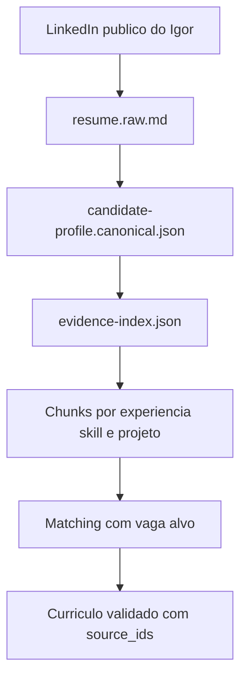

# Planejamento de Arquitetura de Contexto - cv-release

## 1. Visao Geral

O `cv-release` deve ser tratado como um sistema de geracao documental orientado por contexto estruturado, e nao como um simples chatbot que recebe um curriculo e devolve texto.

O objetivo arquitetural e transformar informacoes profissionais dispersas em uma base modular, validavel, reutilizavel e recuperavel por relevancia. A LLM deve receber somente o contexto necessario para cada etapa, sempre com fronteiras claras entre fatos originais, inferencias permitidas, decisoes de adaptacao, validacoes ATS e formato final de renderizacao.

Principios centrais:

- Preservar veracidade: nunca inventar experiencia, cargo, empresa, certificacao, idioma, ferramenta ou resultado.
- Separar fatos de redacao: dados canonicos ficam em JSON/YAML; textos finais ficam em Markdown/HTML derivados.
- Usar prompts versionados: cada prompt tem responsabilidade unica, entrada definida e saida validavel.
- Reduzir contexto por recuperacao seletiva: a LLM nao deve receber todo o historico em todas as etapas.
- Manter rastreabilidade: cada bullet final deve apontar para experiencias, projetos, skills ou conquistas de origem.
- Validar antes de renderizar: PDF nunca deve ser gerado diretamente de texto livre da LLM.
- Versionar outputs: cada vaga deve gerar um pacote audivel com inputs, analises, scores, curriculo final e logs.

## 2. Estrutura de Pastas

A estrutura recomendada separa `data`, `context`, `prompts`, `templates`, `outputs`, `logs` e `config`. Isso evita mistura entre insumos canonicos, contexto derivado, prompts e documentos finais.

```text
cv-release/
  app/
  lib/
  docs/
    PLANEJAMENTO_ARQUITETURA_CONTEXTO.md

  data/
    profile/
      base/
        resume.raw.md
        resume.normalized.json
        personal-info.json
        professional-summary.md
      experiences/
        exp_2021_2024_acme_senior_backend_engineer.json
        exp_2019_2021_beta_fullstack_developer.json
      projects/
        project_payment_platform.json
        project_document_automation.json
      skills/
        technical-skills.yaml
        soft-skills.yaml
        skill-evidence-map.json
      certifications/
        certifications.yaml
      education/
        education.yaml
      languages/
        languages.yaml
      achievements/
        achievements.json
      constraints/
        truth-policy.yaml
        redaction-preferences.yaml

    jobs/
      incoming/
        job_2026-05-22_company-role.raw.md
      normalized/
        job_2026-05-22_company-role.normalized.json
      analyses/
        job_2026-05-22_company-role.requirements.json
        job_2026-05-22_company-role.keyword-map.json
        job_2026-05-22_company-role.risk-analysis.json

    generated/
      versions/
        2026-05-22_company-role_v001/
          input-manifest.json
          match-analysis.json
          resume.target.json
          resume.target.md
          resume.target.html
          ats-score.json
          validation-report.json
          rendering-options.json
          README.md
      comparisons/
        company-role_v001_vs_v002.json

  context/
    canonical/
      candidate-profile.canonical.json
      career-timeline.canonical.json
      evidence-index.json
    chunks/
      profile-summary.chunk.md
      exp_acme_backend.chunk.md
      project_payment_platform.chunk.md
      skills_backend.chunk.md
    indexes/
      context-registry.json
      chunk-manifest.json
      source-map.json
    retrieval/
      last-retrieval-plan.json
      job-to-context-ranking.json
    memory/
      persistent-profile-memory.json
      generation-preferences.yaml
      recruiter-feedback-history.json
    embeddings/
      profile-chunks/
      job-descriptions/
      vector-index.meta.json

  prompts/
    system/
      resume-architect.system.md
      truth-guard.system.md
      ats-optimizer.system.md
    ingestion/
      normalize-resume.prompt.md
      extract-experience.prompt.md
      extract-skills.prompt.md
    job-analysis/
      analyze-job.prompt.md
      extract-job-keywords.prompt.md
      classify-requirements.prompt.md
    matching/
      match-profile-to-job.prompt.md
      rank-experiences.prompt.md
      gap-analysis.prompt.md
    generation/
      generate-target-resume-json.prompt.md
      rewrite-summary.prompt.md
      rewrite-experience-bullets.prompt.md
      generate-cover-letter.prompt.md
    validation/
      validate-factual-consistency.prompt.md
      validate-ats.prompt.md
      score-resume.prompt.md
      critique-as-tech-recruiter.prompt.md
    rendering/
      generate-markdown.prompt.md
      generate-html.prompt.md
      prepare-pdf-metadata.prompt.md
    schemas/
      prompt-io-contracts.md

  schemas/
    profile.schema.json
    experience.schema.json
    project.schema.json
    skill.schema.json
    job.schema.json
    match-analysis.schema.json
    generated-resume.schema.json
    ats-score.schema.json
    validation-report.schema.json

  templates/
    resume/
      ats-premium/
        template.html
        styles.css
        template.config.json
      ats-simple/
        template.html
        styles.css
        template.config.json
      visual-modern/
        template.html
        styles.css
        template.config.json
    markdown/
      resume.md.hbs
      recruiter-summary.md.hbs
    pdf/
      page-settings.json
      font-policy.json

  outputs/
    pdf/
      2026-05-22_company-role_v001.pdf
    markdown/
      2026-05-22_company-role_v001.md
    html/
      2026-05-22_company-role_v001.html
    json/
      2026-05-22_company-role_v001.resume.json

  logs/
    runs/
      2026-05-22T10-30-00_company-role/
        orchestration.log
        llm-calls.jsonl
        token-usage.json
        validation.log
    errors/
      pdf-rendering-errors.log
      schema-validation-errors.log

  config/
    app.config.yaml
    models.config.yaml
    ats.config.yaml
    retrieval.config.yaml
    generation.config.yaml
    privacy.config.yaml
```

### Proposito de cada area

`data/profile/base`
: Guarda o curriculo bruto recebido e a versao normalizada. Deve conter somente informacoes do candidato, sem contexto de vaga.

`data/profile/experiences`
: Uma experiencia por arquivo. Cada experiencia deve ser uma unidade independente com empresa, cargo, periodo, responsabilidades, resultados, tecnologias e evidencias.

`data/profile/projects`
: Projetos relevantes, separados de experiencias formais. Um projeto pode estar ligado a uma experiencia, mas deve ter identidade propria para reuso em diferentes vagas.

`data/profile/skills`
: Skills organizadas por categoria, senioridade, evidencias e frequencia de uso. A LLM deve usar skills somente quando houver evidencia.

`data/profile/certifications`, `education`, `languages`, `achievements`
: Dados estruturados de baixo volume, usados em secoes especificas e em matching.

`data/profile/constraints`
: Politicas do candidato: termos proibidos, estilo preferido, senioridade alvo, restricoes de privacidade, informacoes que nao devem ser enfatizadas.

`data/jobs/incoming`
: Descricoes de vaga brutas, preservadas exatamente como recebidas.

`data/jobs/normalized`
: Versoes estruturadas das vagas, com cargo, empresa, requisitos, responsabilidades, senioridade, localizacao e formato de trabalho.

`data/jobs/analyses`
: Analises derivadas da vaga: keywords, requisitos classificados, riscos, gaps e pesos.

`data/generated/versions`
: Pacote completo de cada geracao. Cada versao deve ser reprodutivel a partir do manifesto.

`context/canonical`
: Contexto consolidado e confiavel. Representa a fonte principal para recuperacao, validacao e geracao.

`context/chunks`
: Blocos compactos, legiveis e recuperaveis. Cada chunk deve ter escopo claro e metadados no manifesto.

`context/indexes`
: Indices de origem, rastreabilidade, duplicidade e relacao entre fatos.

`context/retrieval`
: Artefatos temporarios do plano de recuperacao usado para uma vaga especifica.

`context/memory`
: Preferencias e aprendizados persistentes que nao pertencem a um curriculo especifico, como feedbacks de recrutadores ou escolhas de estilo.

`context/embeddings`
: Vetores e metadados para busca semantica futura. Deve ser reconstruivel a partir de `context/chunks`.

`prompts`
: Prompts versionados por responsabilidade. Cada prompt deve declarar objetivo, entradas, saida esperada, restricoes e formato.

`schemas`
: Contratos formais para dados canonicos, analises e outputs. Toda saida de LLM estruturada deve ser validada contra schema.

`templates`
: Layouts de Markdown, HTML e PDF. Nao devem conter logica de negocio nem regras de ATS.

`outputs`
: Arquivos finais prontos para consumo humano ou download.

`logs`
: Auditoria de execucoes, chamadas de LLM, tokens, erros e validacoes.

`config`
: Parametros de modelo, ATS, recuperacao, privacidade e geracao.

## 3. Estrategia de Context Engineering

### 3.1 Separacao entre fato, contexto e redacao

O sistema deve manter tres camadas distintas:

1. Fatos canonicos
   - Dados estruturados extraidos do curriculo base.
   - Devem ser tratados como verdade operacional.
   - Exemplo: periodo de trabalho, nome da empresa, cargo, tecnologias usadas.

2. Contexto recuperavel
   - Representacoes compactas dos fatos, otimizadas para alimentar prompts.
   - Pode conter sumarios, evidencias e tags.
   - Deve sempre apontar para fontes canonicas.

3. Redacao gerada
   - Versoes adaptadas para vaga.
   - Pode melhorar clareza, ordem, enfase e terminologia.
   - Nao pode criar fatos novos.

Essa separacao reduz hallucinations porque a LLM nao decide o que e verdade; ela apenas transforma fatos selecionados.

### 3.2 Divisao do curriculo em chunks

O curriculo nao deve ser enviado como um unico bloco. A divisao recomendada:

- `profile_identity`: nome, titulo profissional, localizacao, contatos, links.
- `career_summary`: resumo canonico de senioridade, dominios e principais competencias.
- `experience:{id}`: uma experiencia profissional por chunk.
- `project:{id}`: um projeto por chunk.
- `skills:{category}`: skills por categoria tecnica.
- `achievement:{id}`: conquistas mensuraveis e evidencias.
- `education`: formacao.
- `certifications`: certificacoes.
- `languages`: idiomas.
- `preferences`: preferencias de redacao e restricoes.

Cada chunk deve ter metadados:

```json
{
  "chunk_id": "exp_acme_backend",
  "type": "experience",
  "source_file": "data/profile/experiences/exp_2021_2024_acme_senior_backend_engineer.json",
  "time_range": {
    "start": "2021-03",
    "end": "2024-09"
  },
  "roles": ["Senior Backend Engineer"],
  "skills": ["Node.js", "TypeScript", "PostgreSQL", "AWS", "REST APIs"],
  "domains": ["payments", "document automation", "B2B SaaS"],
  "seniority": "senior",
  "evidence_strength": 0.92,
  "token_estimate": 420,
  "last_updated": "2026-05-22"
}
```

### 3.3 Tamanho ideal dos chunks

Recomendacao inicial:

- Chunks de experiencia: 300 a 700 tokens.
- Chunks de projeto: 250 a 600 tokens.
- Chunks de skills: 150 a 400 tokens.
- Sumarios canonicos: 150 a 300 tokens.
- Analise de vaga: 500 a 1200 tokens.

Evitar chunks muito pequenos porque perdem contexto. Evitar chunks muito grandes porque prejudicam ranking, custo e precisao.

### 3.4 Como evitar perda de contexto

Usar redundancia controlada:

- O chunk de experiencia deve conter cargo, empresa, periodo, dominio, principais entregas, tecnologias e metricas.
- O indice global deve mapear skills para evidencias.
- O manifesto deve registrar quais chunks foram usados em cada geracao.
- A validacao factual deve comparar output final contra fontes canonicas.

Exemplo de redundancia aceitavel:

- `experience` informa que o candidato usou `PostgreSQL`.
- `skill-evidence-map` aponta essa experiencia como evidencia para `PostgreSQL`.
- O output final pode mencionar `PostgreSQL` somente se a experiencia/projeto selecionado sustentar isso.

### 3.5 Como reduzir hallucinations

Regras:

- Toda saida estruturada da LLM deve incluir `source_ids`.
- Prompts devem proibir criacao de numeros, certificacoes, empresas, cargos e datas.
- Campos sensiveis devem aceitar `unknown`, `not_provided` ou `insufficient_evidence`.
- A etapa de validacao deve bloquear bullets sem fonte.
- A etapa de score nao deve corrigir o curriculo; apenas avaliar.
- O renderizador deve aceitar somente JSON validado.

Padrao recomendado para bullets gerados:

```json
{
  "text": "Designed and maintained backend APIs for payment workflows using Node.js, TypeScript and PostgreSQL.",
  "source_ids": [
    "experience:exp_2021_2024_acme_senior_backend_engineer",
    "project:project_payment_platform"
  ],
  "keyword_targets": ["backend APIs", "Node.js", "TypeScript", "PostgreSQL", "payments"],
  "claim_type": "supported",
  "risk_level": "low"
}
```

### 3.6 Como manter consistencia entre versoes

Cada versao gerada deve conter:

- `input-manifest.json`: arquivos de origem, hashes e prompts usados.
- `match-analysis.json`: justificativa de selecao de experiencias.
- `resume.target.json`: conteudo final estruturado.
- `validation-report.json`: verificacao factual, ATS e formato.
- `ats-score.json`: score detalhado.
- `README.md`: resumo humano da versao.

Isso permite comparar duas versoes sem depender da memoria do modelo.

### 3.7 Como priorizar informacoes relevantes para cada vaga

Usar ranking hibrido:

1. Requisitos obrigatorios da vaga.
2. Requisitos desejaveis.
3. Responsabilidades principais.
4. Dominio de negocio.
5. Senioridade.
6. Keywords tecnicas.
7. Evidencias mensuraveis.
8. Recencia da experiencia.
9. Forca da evidencia.

Formula conceitual:

```text
context_score =
  requirement_match * 0.35 +
  skill_match * 0.20 +
  domain_match * 0.15 +
  seniority_match * 0.10 +
  evidence_strength * 0.10 +
  recency * 0.05 +
  keyword_coverage * 0.05
```

O resultado deve gerar uma lista de chunks selecionados para a geracao.

### 3.8 Como evitar duplicidade

Criar um `evidence-index.json` com IDs canonicos para conquistas, skills e projetos.

Exemplo:

```json
{
  "evidence_id": "ev_payment_api_latency_reduction",
  "canonical_claim": "Reduced payment API latency by 35%",
  "source_ids": ["project:project_payment_platform"],
  "allowed_variants": [
    "Improved payment API latency by 35%",
    "Reduced latency in payment APIs by 35%"
  ],
  "do_not_repeat_in_sections": ["summary", "experience", "projects"]
}
```

A etapa de montagem final deve detectar:

- Mesma skill repetida em excesso.
- Mesmo projeto citado em varias secoes.
- Bullet semanticamente equivalente.
- Keywords empilhadas sem contexto.

### 3.9 Controle de tokens

O orquestrador deve montar prompts por etapa, nao um prompt unico.

Politica sugerida:

- Analise de curriculo bruto: pode usar contexto maior, pois ocorre poucas vezes.
- Analise de vaga: usa somente vaga bruta.
- Matching: usa vaga normalizada + indices compactos + chunks candidatos.
- Geracao: usa vaga normalizada + top chunks + preferencias + schema.
- Validacao: usa resume gerado + fontes citadas + regras ATS.
- Renderizacao: usa somente JSON final validado + template selecionado.

Budget inicial por etapa:

```yaml
token_budget:
  normalize_resume: 12000
  analyze_job: 6000
  matching: 10000
  generation: 14000
  factual_validation: 10000
  ats_scoring: 8000
  rendering_preparation: 4000
```

## 4. Estrategia de Prompting

### 4.1 Categorias de prompts

Prompts devem ser pequenos, versionados e especializados.

```text
prompts/
  system/       define identidade, regras e limites globais
  ingestion/    transforma dados brutos em dados estruturados
  job-analysis/ extrai requisitos e keywords da vaga
  matching/     compara perfil e vaga
  generation/   cria curriculo alvo estruturado
  validation/   audita fatos, ATS e qualidade
  rendering/    prepara Markdown/HTML/PDF
```

### 4.2 Prompts de sistema

#### `resume-architect.system.md`

Responsabilidade:

- Definir a LLM como arquiteta de curriculos.
- Priorizar clareza, veracidade, ATS e relevancia.
- Proibir invencao de fatos.

Entrada:

- Politicas globais.
- Idioma alvo.
- Tipo de curriculo.

Saida:

- Nao gera output diretamente; condiciona outras etapas.

Exemplo:

```md
You are a resume transformation engine.
Use only provided evidence.
Never invent employers, dates, degrees, certifications, metrics or tools.
When evidence is insufficient, return "insufficient_evidence".
Optimize for ATS parsing, recruiter scanning and technical credibility.
```

#### `truth-guard.system.md`

Responsabilidade:

- Aplicar regra de fidelidade factual.
- Exigir `source_ids`.
- Classificar risco de cada claim.

#### `ats-optimizer.system.md`

Responsabilidade:

- Aplicar criterios ATS.
- Evitar layout e texto que prejudiquem parsing.
- Balancear keywords com legibilidade humana.

### 4.3 Prompts de ingestao

#### `normalize-resume.prompt.md`

Responsabilidade:

- Transformar curriculo bruto em `resume.normalized.json`.
- Identificar lacunas, ambiguidades e dados ausentes.

Entradas:

- `resume.raw.md`
- `profile.schema.json`

Saidas:

- JSON validavel.
- Lista de incertezas.
- Lista de perguntas opcionais ao usuario.

#### `extract-experience.prompt.md`

Responsabilidade:

- Separar cada experiencia em arquivo independente.
- Extrair responsabilidades, resultados, tecnologias e dominio.

Saida esperada:

```json
{
  "experience_id": "exp_2021_2024_acme_senior_backend_engineer",
  "company": "Acme",
  "title": "Senior Backend Engineer",
  "start_date": "2021-03",
  "end_date": "2024-09",
  "employment_type": "full_time",
  "location": "Remote",
  "responsibilities": [],
  "achievements": [],
  "technologies": [],
  "source_confidence": 0.94
}
```

### 4.4 Prompts de analise da vaga

#### `analyze-job.prompt.md`

Responsabilidade:

- Extrair dados estruturados da vaga.
- Separar obrigatorios, desejaveis, responsabilidades e sinais implicitos.

Saida:

```json
{
  "job_id": "job_2026-05-22_company-role",
  "company": "Company",
  "role_title": "Senior Backend Engineer",
  "seniority": "senior",
  "work_model": "remote",
  "must_have": [],
  "nice_to_have": [],
  "responsibilities": [],
  "keywords": [],
  "domain_signals": [],
  "ats_priority_terms": []
}
```

#### `classify-requirements.prompt.md`

Responsabilidade:

- Classificar requisitos por peso.
- Identificar hard skills, soft skills, dominio, senioridade, ferramentas e idiomas.

### 4.5 Prompts de matching

#### `match-profile-to-job.prompt.md`

Responsabilidade:

- Comparar perfil estruturado contra requisitos da vaga.
- Gerar score de aderencia.
- Selecionar chunks relevantes.

Saida:

```json
{
  "overall_match": 0.82,
  "requirement_matches": [
    {
      "requirement": "Node.js",
      "status": "strong_match",
      "evidence_ids": ["experience:exp_2021_2024_acme_senior_backend_engineer"],
      "confidence": 0.95
    }
  ],
  "selected_context_chunks": [
    {
      "chunk_id": "exp_acme_backend",
      "reason": "Strong backend and Node.js evidence",
      "priority": 1
    }
  ],
  "gaps": []
}
```

#### `rank-experiences.prompt.md`

Responsabilidade:

- Ordenar experiencias e projetos para a vaga.
- Indicar o que deve ser enfatizado, reduzido ou omitido.

### 4.6 Prompts de geracao

#### `generate-target-resume-json.prompt.md`

Responsabilidade:

- Gerar o curriculo final em JSON estruturado.
- Aplicar idioma alvo, template alvo e foco da vaga.
- Manter source_ids em cada claim.

Entrada:

- Vaga normalizada.
- Chunks selecionados.
- Preferencias do candidato.
- Schema do curriculo gerado.
- Politica de verdade.

Saida:

- `resume.target.json`

#### `rewrite-summary.prompt.md`

Responsabilidade:

- Reescrever o resumo profissional para a vaga.
- Manter entre 3 e 5 linhas.
- Incluir senioridade, dominio, principais stacks e proposta de valor.

#### `rewrite-experience-bullets.prompt.md`

Responsabilidade:

- Reescrever bullets com foco em impacto, acao, tecnologia e resultado.
- Evitar exagero e keywords desconectadas.

Formato ideal de bullet:

```text
Action + scope/context + technology/method + measurable or concrete outcome.
```

Exemplo:

```text
Designed backend services for payment workflows using Node.js and PostgreSQL, improving reliability across high-volume transaction processing.
```

### 4.7 Prompts de validacao

#### `validate-factual-consistency.prompt.md`

Responsabilidade:

- Checar se cada claim do curriculo final tem fonte.
- Marcar claims sem evidencia.
- Bloquear output final se houver riscos altos.

Saida:

```json
{
  "status": "blocked",
  "issues": [
    {
      "severity": "high",
      "field": "experience[0].bullets[2]",
      "problem": "Metric 40% is not present in any source evidence",
      "recommended_action": "Remove the metric or ask user for confirmation"
    }
  ]
}
```

#### `validate-ats.prompt.md`

Responsabilidade:

- Avaliar parsing, estrutura, palavras-chave, densidade, secoes e legibilidade.

#### `score-resume.prompt.md`

Responsabilidade:

- Gerar score ATS e score de recrutador tecnico.
- Nao alterar o curriculo.

### 4.8 Prompts de renderizacao

#### `generate-markdown.prompt.md`

Responsabilidade:

- Converter JSON validado para Markdown final.
- Nao alterar conteudo substantivo.

#### `generate-html.prompt.md`

Responsabilidade:

- Preparar HTML semântico para PDF.
- Preservar secoes, headings e ordem.

#### `prepare-pdf-metadata.prompt.md`

Responsabilidade:

- Gerar titulo, nome do arquivo, metadados, idioma e configuracoes de pagina.

### 4.9 Estrategia de chaining

Fluxo recomendado:

```text
resume.raw.md
  -> normalize-resume
  -> extract-experience / extract-skills / extract-projects
  -> build canonical context

job.raw.md
  -> analyze-job
  -> classify-requirements
  -> extract-job-keywords

canonical context + job analysis
  -> match-profile-to-job
  -> rank-experiences
  -> gap-analysis

selected context + job analysis
  -> generate-target-resume-json
  -> validate-factual-consistency
  -> validate-ats
  -> score-resume

validated resume json
  -> generate-markdown
  -> generate-html
  -> render-pdf
```

Cada etapa deve produzir um arquivo persistido. Isso permite reexecutar somente a etapa que falhou.

## 5. Pipeline do Sistema

### 5.1 Fluxo completo

#### 1. Receber curriculo base

Entradas aceitas no futuro:

- PDF.
- DOCX.
- Markdown.
- Texto colado.
- LinkedIn exportado.
- JSON estruturado.

Validacoes:

- Arquivo legivel.
- Tamanho maximo permitido.
- Idioma detectado.
- Dados pessoais detectados.
- Permissao de armazenamento.

Output:

- `data/profile/base/resume.raw.md`

#### 2. Estruturar dados

Processos:

- Parse do texto.
- Normalizacao de secoes.
- Extracao de experiencias.
- Extracao de skills.
- Extracao de formacao, certificacoes e idiomas.
- Criacao de IDs canonicos.
- Validacao contra schemas.

Outputs:

- `resume.normalized.json`
- Arquivos em `experiences`, `projects`, `skills`, etc.
- `candidate-profile.canonical.json`
- `evidence-index.json`

Ponto critico:

- Nao descartar texto original. O bruto deve ficar preservado para auditoria.

#### 3. Receber vaga

Entradas:

- Texto da vaga.
- URL da vaga.
- PDF ou imagem convertida para texto.
- Dados estruturados via formulario.

Output:

- `data/jobs/incoming/job_{date}_{company-role}.raw.md`

#### 4. Extrair requisitos da vaga

Processos:

- Identificar senioridade.
- Identificar requisitos obrigatorios.
- Identificar requisitos desejaveis.
- Extrair responsabilidades.
- Extrair keywords ATS.
- Detectar dominio de negocio.
- Detectar idioma esperado.
- Detectar sinais de cultura e soft skills.

Output:

- `job.normalized.json`
- `job.requirements.json`
- `job.keyword-map.json`

#### 5. Realizar matching

Processos:

- Comparar requisitos com skills e evidencias.
- Calcular score por requisito.
- Identificar gaps reais.
- Identificar experiencias mais relevantes.
- Criar plano de contexto.

Output:

- `match-analysis.json`
- `job-to-context-ranking.json`

Ponto critico:

- Diferenciar `match forte`, `match parcial`, `sem evidencia` e `nao aplicavel`.

#### 6. Priorizar experiencias relevantes

Processos:

- Ordenar experiencias por aderencia.
- Escolher bullets a destacar.
- Reduzir detalhes irrelevantes.
- Decidir se projetos devem aparecer como secao propria.

Output:

- Plano de curriculo alvo.

#### 7. Reescrever curriculo

Processos:

- Gerar resumo profissional.
- Reordenar skills.
- Reescrever bullets.
- Ajustar titulo profissional.
- Selecionar projetos.
- Gerar JSON final.

Output:

- `resume.target.json`

Ponto critico:

- Reescrita deve ser transformacional, nao ficcional.

#### 8. Validar ATS

Validacoes:

- Estrutura padrao.
- Headings reconheciveis.
- Densidade de keywords.
- Ausencia de tabelas problematicas.
- Datas parseaveis.
- Links claros.
- Ausencia de imagens para conteudo textual.
- Bullets legiveis.
- Tamanho adequado.
- Consistencia factual.

Outputs:

- `validation-report.json`
- `ats-score.json`

#### 9. Gerar versao final

Processos:

- Ajustar problemas bloqueantes.
- Gerar Markdown.
- Gerar HTML.
- Registrar manifesto.

Outputs:

- `resume.target.md`
- `resume.target.html`
- `README.md` da versao.

#### 10. Exportar PDF

Processos:

- Aplicar template.
- Renderizar HTML para PDF.
- Validar tamanho, quebras e fontes.
- Salvar em `outputs/pdf`.

Output:

- `outputs/pdf/{date}_{company-role}_v001.pdf`

### 5.2 Decisoes arquiteturais

- Usar JSON como contrato principal entre etapas.
- Usar Markdown para textos humanos e prompts.
- Usar YAML para configuracoes editaveis.
- Usar HTML/CSS para layout de PDF.
- Usar LLM somente onde ha ambiguidade linguistica, ranking semantico ou transformacao textual.
- Usar validadores deterministicos para schemas, campos obrigatorios e regras de renderizacao.
- Persistir todos os artefatos intermediarios relevantes.

### 5.3 Pontos criticos

- PDF gerado diretamente de texto livre e um risco. Deve vir de JSON validado.
- Keywords sem evidencia geram curriculo artificial e perigoso.
- Reescrita excessiva pode mudar senioridade real.
- ATS nao deve ser otimizado sacrificando legibilidade humana.
- Prompts longos demais reduzem controle. Preferir cadeia de prompts menores.
- Versoes devem ser comparaveis e reproduziveis.

## 6. Modelagem de Dados

### 6.1 Experiencia profissional

Formato recomendado: JSON.

Vantagens:

- Validavel por schema.
- Facil de indexar.
- Bom para source mapping.
- Bom para renderizacao final.

Exemplo:

```json
{
  "experience_id": "exp_2021_2024_acme_senior_backend_engineer",
  "company": "Acme",
  "title": "Senior Backend Engineer",
  "start_date": "2021-03",
  "end_date": "2024-09",
  "location": "Remote",
  "employment_type": "full_time",
  "summary": "Backend engineering role focused on payment APIs and document automation.",
  "responsibilities": [
    {
      "text": "Designed and maintained backend APIs for payment workflows.",
      "skills": ["Node.js", "TypeScript", "PostgreSQL"],
      "source": "resume.raw.md#experience-acme"
    }
  ],
  "achievements": [
    {
      "achievement_id": "ach_acme_api_latency",
      "text": "Reduced API latency by 35%.",
      "metric": {
        "type": "latency_reduction",
        "value": 35,
        "unit": "percent"
      },
      "confidence": 0.9,
      "requires_user_confirmation": false
    }
  ],
  "technologies": ["Node.js", "TypeScript", "PostgreSQL", "AWS"],
  "domains": ["payments", "document automation"],
  "source_confidence": 0.94
}
```

### 6.2 Skills

Formato recomendado: YAML para edicao humana + JSON derivado para processamento.

Exemplo:

```yaml
technical_skills:
  backend:
    - name: Node.js
      level: advanced
      years: 5
      evidence_ids:
        - exp_2021_2024_acme_senior_backend_engineer
    - name: PostgreSQL
      level: advanced
      years: 4
      evidence_ids:
        - project_payment_platform

  cloud:
    - name: AWS
      level: intermediate
      years: 3
      evidence_ids:
        - exp_2021_2024_acme_senior_backend_engineer
```

### 6.3 Projetos

Formato recomendado: JSON.

```json
{
  "project_id": "project_payment_platform",
  "name": "Payment Platform",
  "associated_experience_ids": ["exp_2021_2024_acme_senior_backend_engineer"],
  "description": "Backend platform for payment workflow automation.",
  "role": "Backend engineer",
  "technologies": ["Node.js", "TypeScript", "PostgreSQL", "AWS"],
  "outcomes": [
    {
      "text": "Improved transaction processing reliability.",
      "metric": null,
      "confidence": 0.8
    }
  ],
  "relevance_tags": ["payments", "backend", "apis", "reliability"]
}
```

### 6.4 Vagas

Formato recomendado: JSON.

```json
{
  "job_id": "job_2026-05-22_company_senior_backend_engineer",
  "source": {
    "type": "manual_text",
    "url": null,
    "received_at": "2026-05-22T10:30:00-03:00"
  },
  "company": "Company",
  "role_title": "Senior Backend Engineer",
  "seniority": "senior",
  "location": "Remote",
  "language": "en",
  "requirements": {
    "must_have": [
      {
        "text": "Strong experience with Node.js",
        "category": "technical_skill",
        "normalized_keyword": "Node.js",
        "weight": 0.95
      }
    ],
    "nice_to_have": []
  },
  "responsibilities": [],
  "keywords": [],
  "domain_signals": []
}
```

### 6.5 Output gerado

Formato recomendado: JSON como fonte final + Markdown/HTML/PDF derivados.

```json
{
  "generated_resume_id": "2026-05-22_company-role_v001",
  "target_job_id": "job_2026-05-22_company-role",
  "language": "en",
  "template": "ats-premium",
  "candidate": {
    "name": "Candidate Name",
    "headline": "Senior Backend Engineer"
  },
  "sections": {
    "summary": {
      "text": "Senior Backend Engineer with experience in payment platforms, APIs and cloud-based systems.",
      "source_ids": ["context:career_summary", "experience:exp_2021_2024_acme_senior_backend_engineer"]
    },
    "skills": [],
    "experience": [],
    "projects": [],
    "education": [],
    "certifications": [],
    "languages": []
  }
}
```

### 6.6 Score ATS

```json
{
  "ats_score_id": "ats_2026-05-22_company-role_v001",
  "overall_score": 86,
  "categories": {
    "keyword_coverage": 88,
    "format_parseability": 95,
    "role_alignment": 84,
    "technical_depth": 82,
    "readability": 90,
    "factual_risk": 96
  },
  "missing_keywords": ["Kubernetes"],
  "overused_keywords": [],
  "risks": [
    {
      "severity": "medium",
      "message": "Kubernetes appears in job requirements but has no supporting evidence."
    }
  ],
  "recommendations": []
}
```

### 6.7 Palavras-chave

```json
{
  "keyword": "Node.js",
  "category": "hard_skill",
  "job_weight": 0.95,
  "profile_evidence_strength": 0.9,
  "recommended_usage": "include_in_skills_and_recent_experience",
  "source_ids": ["experience:exp_2021_2024_acme_senior_backend_engineer"]
}
```

### 6.8 Metricas de aderencia

```json
{
  "requirement": "Experience building REST APIs",
  "match_status": "strong_match",
  "score": 0.92,
  "evidence_ids": ["experience:exp_2021_2024_acme_senior_backend_engineer"],
  "recommended_resume_action": "emphasize_in_summary_and_first_experience"
}
```

### 6.9 JSON vs Markdown vs YAML

JSON:

- Melhor para contratos, validacao, APIs e renderizacao.
- Pior para edicao manual extensa.

Markdown:

- Melhor para textos longos, prompts, curriculos brutos e revisao humana.
- Pior para validacao rigorosa.

YAML:

- Melhor para configuracoes e listas editaveis.
- Exige cuidado com indentacao e parsing.

Hibrido recomendado:

- JSON para dados processaveis.
- Markdown para prompts e textos finais.
- YAML para configuracoes e preferencias.

## 7. Estrategia de Memoria e Contexto Persistente

### 7.1 O que deve ficar persistido

- Curriculo bruto original.
- Perfil canonico normalizado.
- Experiencias individuais.
- Projetos.
- Skills e evidencias.
- Certificacoes, formacao e idiomas.
- Historico de vagas.
- Analises de vagas.
- Match analyses.
- Versoes geradas.
- Scores ATS.
- Relatorios de validacao.
- Feedbacks do usuario e de recrutadores.
- Preferencias de estilo e idioma.

### 7.2 O que deve ser temporario

- Prompts montados para uma chamada especifica.
- Chunks selecionados para uma execucao.
- Respostas intermediarias descartaveis que foram consolidadas.
- Cache de parsing de arquivos.
- HTML temporario de renderizacao, quando ja houver HTML final salvo.

### 7.3 Reuso entre execucoes

O fluxo ideal:

1. Atualizar perfil canonico somente quando o usuario mudar o curriculo base.
2. Reusar chunks existentes para novas vagas.
3. Gerar nova analise para cada vaga.
4. Recalcular matching para cada vaga.
5. Gerar nova versao sem alterar historico anterior.

### 7.4 Versionamento de curriculos

Convencao:

```text
{yyyy-mm-dd}_{company-slug}_{role-slug}_v{nnn}
```

Exemplo:

```text
2026-05-22_acme_senior-backend-engineer_v001
```

Cada versao deve ter:

- ID unico.
- Data/hora.
- Job ID.
- Template.
- Idioma.
- Modelo LLM.
- Prompt versions.
- Hashes dos arquivos fonte.
- Score ATS.
- Status de validacao.

### 7.5 Historico de vagas

O historico permite:

- Comparar aderencia entre vagas.
- Identificar skills frequentemente ausentes.
- Medir evolucao do curriculo.
- Detectar quais keywords aparecem com mais frequencia no mercado alvo.

Arquivo sugerido:

```json
{
  "jobs_seen": [
    {
      "job_id": "job_2026-05-22_company-role",
      "company": "Company",
      "role_title": "Senior Backend Engineer",
      "received_at": "2026-05-22",
      "match_score": 0.82,
      "generated_versions": ["2026-05-22_company-role_v001"]
    }
  ]
}
```

### 7.6 Comparacao entre versoes

Comparar:

- Mudancas no resumo.
- Skills adicionadas/removidas.
- Ordem das experiencias.
- Bullets alterados.
- Keywords cobertas.
- Score ATS.
- Risco factual.
- Tamanho final.

Output:

```json
{
  "base_version": "v001",
  "target_version": "v002",
  "summary_changes": [],
  "keyword_coverage_delta": 6,
  "ats_score_delta": 4,
  "factual_risk_delta": -2,
  "recommendation": "v002 is better for ATS, but v001 has slightly stronger readability."
}
```

## 8. Estrategia ATS

### 8.1 Criterios modernos de ATS

Um curriculo ATS-friendly deve:

- Usar headings padrao: Summary, Skills, Experience, Projects, Education, Certifications.
- Evitar tabelas complexas.
- Evitar texto importante em imagens.
- Evitar colunas que quebrem ordem de leitura.
- Usar datas consistentes.
- Ter cargos, empresas e periodos claros.
- Incluir keywords relevantes da vaga com evidencia.
- Evitar keyword stuffing.
- Usar bullets objetivos.
- Manter hierarquia semantica clara.
- Exportar PDF com texto selecionavel.
- Preservar links como texto e URL real.

### 8.2 Palavras-chave

Classificacao:

- Hard skills: linguagens, frameworks, bancos, cloud, ferramentas.
- Domain keywords: payments, healthcare, fintech, SaaS, e-commerce.
- Methodologies: Agile, Scrum, CI/CD, TDD.
- Responsibilities: architecture, mentoring, API design, migration.
- Seniority signals: leadership, ownership, scalability, reliability.
- Soft skills: communication, collaboration, stakeholder management.

Uso recomendado:

- Resumo: 3 a 6 keywords principais.
- Skills: lista organizada por categoria.
- Experiencia: keywords dentro de contexto real.
- Projetos: keywords tecnicas ligadas a entregas.

### 8.3 Parsing

Regras:

- Nao colocar nome e contato em header invisivel ou imagem.
- Evitar icones como unico indicador de telefone/email/link.
- Usar texto claro: `Email:`, `LinkedIn:`, `GitHub:`.
- Datas em formato consistente: `Mar 2021 - Sep 2024` ou `2021-03 - 2024-09`.
- Evitar rodapes com informacao essencial.
- Usar fontes comuns e incorporadas.

### 8.4 Legibilidade

Regras:

- Uma pagina para perfis mais curtos; duas paginas se senioridade justificar.
- Bullets com 1 a 2 linhas.
- 4 a 6 bullets por experiencia principal.
- 2 a 4 bullets para experiencias antigas.
- Skills agrupadas, nao lista caotica.
- Evitar paragrafos longos.

### 8.5 Estrutura ideal

Ordem recomendada para tech:

1. Name and contact.
2. Professional headline.
3. Professional summary.
4. Technical skills.
5. Professional experience.
6. Selected projects, se relevantes.
7. Education.
8. Certifications.
9. Languages.

Para vagas academicas ou certificacao intensa, a ordem pode mudar.

### 8.6 Erros comuns

- Inventar metricas para parecer mais forte.
- Repetir a mesma keyword em todos os bullets.
- Omitir stack tecnica nas experiencias.
- Usar template visual bonito mas ruim para parsing.
- Misturar idiomas sem intencao.
- Usar cargo alvo muito diferente do historico real.
- Colocar skills sem evidencia.
- Criar resumo generico.
- Ignorar senioridade da vaga.

### 8.7 Otimizacao semantica

O sistema deve mapear sinonimos:

```json
{
  "REST APIs": ["RESTful services", "backend APIs", "HTTP APIs"],
  "CI/CD": ["continuous integration", "deployment pipelines"],
  "AWS": ["cloud infrastructure", "Amazon Web Services"]
}
```

Mas o curriculo final deve preferir os termos usados na vaga quando houver evidencia real.

### 8.8 Adaptacao para tech recruiters

Tech recruiters buscam:

- Stack principal rapidamente visivel.
- Recencia das tecnologias.
- Escopo dos sistemas.
- Impacto tecnico ou de negocio.
- Senioridade demonstrada por ownership.
- Clareza sobre contribuicao individual.
- Projetos relevantes para a vaga.

O curriculo deve responder rapidamente:

- O candidato ja fez trabalho parecido?
- Em qual escala?
- Com quais tecnologias?
- Qual foi o impacto?
- A experiencia e recente?
- Ha sinais de senioridade?

## 9. Estrategia de Geracao de PDF

### 9.1 Pipeline recomendado

```text
resume.target.json
  -> schema validation
  -> markdown generation
  -> html generation
  -> template application
  -> PDF rendering
  -> PDF text extraction validation
  -> final output
```

### 9.2 HTML para PDF

Abordagem recomendada:

- Gerar HTML semantico a partir de JSON validado.
- Aplicar CSS do template.
- Renderizar via motor headless no backend.
- Validar PDF resultante com extracao de texto.

Vantagens:

- Controle fino de layout.
- Suporte a multiplos templates.
- Boa separacao entre conteudo e apresentacao.
- Facil preview no navegador.

Alternativas:

- Markdown para PDF: simples, menos controle visual.
- DOCX para PDF: util para compatibilidade corporativa, mais complexo.
- PDF programatico direto: alto controle, mas mais custo de manutencao.

### 9.3 Separacao entre conteudo e layout

Conteudo:

- `resume.target.json`
- Seccoes, bullets, skills, links.

Layout:

- `templates/resume/{template}/template.html`
- `styles.css`
- `template.config.json`

Renderizacao:

- Recebe conteudo validado + template selecionado.
- Nao chama LLM.
- Nao altera texto.

### 9.4 Templates modernos

Templates sugeridos:

- `ats-simple`: maxima compatibilidade, uma coluna, minima decoracao.
- `ats-premium`: visual moderno com estrutura ATS segura.
- `visual-modern`: melhor para envio direto a pessoas, ainda mantendo texto parseavel.
- `executive`: foco em lideranca, resultados e estrategia.
- `compact-tech`: foco em skills e experiencia tecnica.

### 9.5 Regras de responsividade

Mesmo sendo PDF, o HTML deve funcionar em preview responsivo:

- Largura maxima controlada.
- Quebras de pagina previsiveis.
- Evitar secoes orfas.
- Evitar bullets divididos entre paginas quando possivel.
- Tamanho de fonte legivel.

### 9.6 Validacao do PDF final

Validar:

- PDF existe e nao esta vazio.
- Texto pode ser selecionado.
- Nome, email, experiencia e skills aparecem no texto extraido.
- Numero de paginas dentro do limite.
- Links preservados.
- Nao ha cortes visuais.
- Nao ha texto sobreposto.

## 10. Escalabilidade Futura

### 10.1 Multiplos idiomas

Separar:

- Idioma do perfil original.
- Idioma da vaga.
- Idioma alvo do curriculo.

Arquivos:

```text
config/language.config.yaml
prompts/generation/rewrite-summary.pt-BR.prompt.md
prompts/generation/rewrite-summary.en.prompt.md
templates/resume/ats-premium/i18n/en.json
templates/resume/ats-premium/i18n/pt-BR.json
```

### 10.2 Multiplos templates

Usar registry:

```json
{
  "templates": [
    {
      "template_id": "ats-premium",
      "supports_ats": true,
      "best_for": ["tech", "product", "data"],
      "max_pages_recommended": 2
    }
  ]
}
```

### 10.3 Fine-tuning futuro

Fine-tuning pode ser considerado depois que houver:

- Muitos exemplos de curriculos gerados.
- Feedback humano rotulado.
- Pares vaga -> curriculo final aprovado.
- Avaliacoes de qualidade.

Antes disso, RAG + prompts bem estruturados tende a ser mais seguro.

### 10.4 Embeddings e RAG

Embeddings devem ser usados para:

- Recuperar experiencias mais relevantes.
- Encontrar projetos similares a requisitos.
- Mapear keywords da vaga a evidencias.
- Comparar vagas entre si.

Nao usar embeddings como unica fonte de verdade. O vetor ajuda a recuperar; o JSON canonico valida.

### 10.5 Ranking semantico

Futuro ranking em duas etapas:

1. Busca semantica por embeddings.
2. Re-ranking por regras e LLM com evidencia.

Isso melhora precisao sem aumentar muito custo.

### 10.6 Multiplos modelos

Sugestao:

- Modelo barato para extracao simples.
- Modelo forte para reescrita e matching critico.
- Modelo barato/deterministico para validacao de formato.
- Validador local para schemas.

Config:

```yaml
models:
  resume_normalization:
    provider: openai
    model: model-for-structured-extraction
  resume_generation:
    provider: openai
    model: model-for-high-quality-writing
  ats_validation:
    provider: openai
    model: model-for-evaluation
```

### 10.7 Agentes especializados

Possiveis agentes:

- `Profile Normalizer`: estrutura perfil base.
- `Job Analyst`: entende vaga.
- `Context Retriever`: seleciona chunks.
- `Resume Writer`: gera curriculo.
- `Truth Validator`: verifica factualidade.
- `ATS Auditor`: avalia compatibilidade.
- `Tech Recruiter Reviewer`: avalia impacto humano.
- `PDF Renderer`: gera artefato final sem LLM.

Importante:

- Agentes devem trocar dados estruturados, nao texto livre sem contrato.

### 10.8 Avaliacao automatica

Metricas futuras:

- ATS score.
- Factual consistency score.
- Keyword coverage.
- Recruiter readability score.
- Technical depth score.
- Brevity score.
- Duplicate content score.
- Job alignment score.

### 10.9 Score comparativo entre vagas

O sistema pode ajudar o usuario a decidir onde aplicar:

```json
{
  "jobs": [
    {
      "job_id": "job_a",
      "match_score": 0.88,
      "missing_critical_requirements": 1,
      "resume_generation_confidence": 0.91
    },
    {
      "job_id": "job_b",
      "match_score": 0.64,
      "missing_critical_requirements": 4,
      "resume_generation_confidence": 0.72
    }
  ]
}
```

## 11. Estrutura Final Recomendada

### 11.1 Arvore completa resumida

```text
cv-release/
  docs/
  app/
  lib/
  data/
    profile/
      base/
      experiences/
      projects/
      skills/
      certifications/
      education/
      languages/
      achievements/
      constraints/
    jobs/
      incoming/
      normalized/
      analyses/
    generated/
      versions/
      comparisons/
  context/
    canonical/
    chunks/
    indexes/
    retrieval/
    memory/
    embeddings/
  prompts/
    system/
    ingestion/
    job-analysis/
    matching/
    generation/
    validation/
    rendering/
    schemas/
  schemas/
  templates/
    resume/
    markdown/
    pdf/
  outputs/
    pdf/
    markdown/
    html/
    json/
  logs/
    runs/
    errors/
  config/
```

### 11.2 Exemplos reais de arquivos

#### `config/generation.config.yaml`

```yaml
default_language: en
default_template: ats-premium
max_pages: 2
summary:
  min_lines: 3
  max_lines: 5
experience:
  max_bullets_recent: 6
  max_bullets_older: 4
truth_policy:
  require_source_ids: true
  allow_inferred_soft_skills: false
  allow_generated_metrics: false
```

#### `config/ats.config.yaml`

```yaml
sections:
  required:
    - Summary
    - Skills
    - Experience
  optional:
    - Projects
    - Education
    - Certifications
    - Languages
keywords:
  max_repetition_per_keyword: 5
  require_contextual_usage: true
format:
  avoid_tables: true
  avoid_images_for_text: true
  require_selectable_text: true
```

#### `context/indexes/source-map.json`

```json
{
  "sources": [
    {
      "source_id": "experience:exp_2021_2024_acme_senior_backend_engineer",
      "file": "data/profile/experiences/exp_2021_2024_acme_senior_backend_engineer.json",
      "type": "experience"
    }
  ]
}
```

### 11.3 Exemplo de prompt completo

Arquivo: `prompts/matching/match-profile-to-job.prompt.md`

```md
# Objective

Match the candidate profile evidence against the normalized job requirements.

# Inputs

- Normalized job JSON
- Candidate context chunks
- Skill evidence map
- Truth policy

# Rules

- Use only provided evidence.
- Do not infer experience from skill names alone.
- Classify each requirement as strong_match, partial_match, weak_match, no_evidence or not_applicable.
- Include source_ids for every match.
- Return valid JSON only.

# Output Schema

Return:

{
  "overall_match": number,
  "requirement_matches": [],
  "selected_context_chunks": [],
  "gaps": [],
  "recommended_strategy": string
}
```

### 11.4 Exemplo de payload para geracao

```json
{
  "run_id": "2026-05-22T10-30-00_company-role",
  "target_language": "en",
  "template": "ats-premium",
  "job": {
    "job_id": "job_2026-05-22_company-role",
    "role_title": "Senior Backend Engineer",
    "must_have": ["Node.js", "REST APIs", "PostgreSQL"]
  },
  "selected_context": [
    {
      "chunk_id": "exp_acme_backend",
      "content": "Senior backend role focused on payment APIs using Node.js, TypeScript and PostgreSQL.",
      "source_ids": ["experience:exp_2021_2024_acme_senior_backend_engineer"]
    }
  ],
  "constraints": {
    "max_pages": 2,
    "do_not_invent_metrics": true,
    "require_source_ids": true
  }
}
```

### 11.5 Convencoes de nomenclatura

Arquivos de experiencia:

```text
exp_{startYear}_{endYear}_{companySlug}_{roleSlug}.json
```

Projetos:

```text
project_{projectSlug}.json
```

Vagas:

```text
job_{yyyy-mm-dd}_{companySlug}_{roleSlug}.raw.md
job_{yyyy-mm-dd}_{companySlug}_{roleSlug}.normalized.json
```

Versoes:

```text
{yyyy-mm-dd}_{companySlug}_{roleSlug}_v{nnn}
```

Prompts:

```text
{verb}-{object}.prompt.md
```

Schemas:

```text
{domain}.schema.json
```

### 11.6 Melhores praticas

- Nunca usar a LLM como banco de memoria.
- Nunca confiar em texto gerado sem schema.
- Nunca renderizar PDF antes da validacao.
- Preservar sempre o input bruto.
- Salvar outputs intermediarios importantes.
- Exigir `source_ids` em claims finais.
- Separar prompts por responsabilidade.
- Separar conteudo de layout.
- Evitar duplicidade com indice de evidencias.
- Usar ranking de contexto antes da geracao.
- Validar ATS e factualidade em etapas separadas.
- Medir custo de tokens por run.
- Comparar versoes com dados estruturados.
- Tratar preferencias do usuario como configuracao, nao prompt solto.
- Manter templates independentes da logica de negocio.

## 12. Roadmap de Implementacao Futura

### Fase 1 - Contratos e base documental

- Criar schemas JSON principais.
- Criar estrutura de diretorios.
- Criar prompts iniciais.
- Definir configuracoes base.
- Implementar manifestos de versao.

### Fase 2 - Ingestao e normalizacao

- Receber curriculo bruto.
- Extrair texto de PDF.
- Normalizar perfil.
- Criar experiencias, projetos e skills.
- Validar dados estruturados.

### Fase 3 - Analise de vaga e matching

- Receber vaga.
- Normalizar vaga.
- Extrair requisitos.
- Calcular matching.
- Selecionar chunks.

### Fase 4 - Geracao e validacao

- Gerar curriculo alvo em JSON.
- Validar factualidade.
- Validar ATS.
- Gerar score.
- Ajustar problemas bloqueantes.

### Fase 5 - Renderizacao

- Criar templates HTML/CSS.
- Gerar Markdown e HTML.
- Renderizar PDF.
- Validar PDF final.

### Fase 6 - RAG, embeddings e avaliacao avancada

- Gerar embeddings de chunks.
- Implementar busca semantica.
- Criar ranking hibrido.
- Criar comparacao entre vagas.
- Criar avaliacao automatica com historico.

## 13. Decisao Arquitetural Principal

A arquitetura recomendada para o `cv-release` deve ser centrada em contexto estruturado e rastreavel.

O sistema nao deve perguntar a LLM "gere um curriculo para essa vaga" com todo o texto bruto. Ele deve:

1. Transformar curriculo em fatos canonicos.
2. Transformar vaga em requisitos ponderados.
3. Recuperar somente evidencias relevantes.
4. Gerar curriculo estruturado.
5. Validar factualidade e ATS.
6. Renderizar PDF a partir de conteudo validado.

Essa abordagem aumenta precisao, reduz custo de tokens, diminui hallucinations, facilita manutencao e permite evoluir para RAG, embeddings, multiplos modelos e agentes especializados sem reescrever o produto inteiro.

## 14. Planejamento Especifico Para o Perfil Igor Cardoso

Esta secao aplica a arquitetura geral do `cv-release` ao perfil publico de Igor Cardoso Francolin, usando como fonte bruta o LinkedIn `https://www.linkedin.com/in/igor-cardoso-francolin/`. O objetivo e documentar como transformar esse perfil em insumos canonicos, chunks recuperaveis e versoes de curriculo rastreaveis, sem inventar fatos nao presentes na fonte.

### 14.1 Fonte e limites de veracidade

**Fonte primaria**

- LinkedIn publico do candidato (perfil, About, Experience, Education, Certifications, Skills, Projects).
- Projetos com link publico no GitHub quando citados no perfil (ex.: `Ponto de Venda`).

**Regras de uso da fonte**

- LinkedIn e tratado como `resume.raw` e nao como verdade canonica final.
- Texto do About pode alimentar `professional-summary.md` somente apos normalizacao e validacao de claims.
- Atividades curtidas, repostadas ou comentadas no feed **nao** viram experiencia, skill comprovada ou conquista mensuravel.
- Reposts sobre Node.js, async, Delphi ou seguranca de API podem entrar em `context/memory/interest-signals.json` como sinais de interesse, com `claim_type: interest_only` e sem `evidence_strength` para matching.
- Metricas de impacto (percentuais, volume de requisicoes, reducao de latencia) so entram no canonico com `requires_user_confirmation: true` ou fonte externa verificavel.
- Nao inferir senioridade alem do que o cargo e periodo sustentam; nao promover "3 anos e 2 meses" de experiencia total a "senior" sem confirmacao.

**Campos proibidos de inventar**

- Empresas, cargos, datas, certificacoes, idiomas, niveis de skill, resultados numericos, stack nao mencionada no perfil ou em projeto vinculado.

### 14.2 Inventario canonico inicial

Separacao entre **fatos extraidos** (podem ir para JSON/YAML apos normalizacao) e **pendentes de confirmacao**.

#### 14.2.1 Identidade e contato

| Campo | Valor (fonte LinkedIn) | Status |
|-------|------------------------|--------|
| Nome | Igor Cardoso | confirmado |
| Headline | Developer \| Node.js \| SQL | confirmado |
| Localizacao | Monte Alto, Sao Paulo, Brazil | confirmado |
| Empresa atual (headline) | Accesys Solutions | confirmado |
| E-mail | igorcardosofrancolin@outlook.com | confirmado (About) |
| LinkedIn | linkedin.com/in/igor-cardoso-francolin | confirmado |
| GitHub | github.com/Igorcard | confirmado |
| Experiencia total declarada | 3 years and 2 months | confirmado (LinkedIn aggregate) |
| Idiomas | not_provided | requires_user_confirmation |

#### 14.2.2 Experiencias profissionais

| experience_id (proposto) | Empresa | Cargo | Periodo | Evidencia |
|--------------------------|---------|-------|---------|-----------|
| exp_2025_present_accesys_backend_developer | Accesys Solutions | Desenvolvedor De Back End | Apr 2025 - Present | LinkedIn Experience |
| exp_2024_2025_accesys_delphi_developer | Accesys Solutions | Desenvolvedor Delphi | Apr 2024 - Apr 2025 | LinkedIn Experience |
| exp_2024_accesys_technical_support | Accesys Solutions | Suporte Tecnico | Feb 2024 - Apr 2024 | LinkedIn Experience |
| exp_2023_2024_accesys_it_support_intern | Accesys Solutions | Estagiario De Suporte De Informatica | Jul 2023 - Feb 2024 | LinkedIn Experience |
| exp_2023_senai_intern | SENAI "Oscar Lucio Baldan" | Estagiario | Feb 2023 - Jul 2023 | LinkedIn Experience |

**Fatos por experiencia (resumo operacional)**

- **Backend (atual):** APIs e integracoes com Node.js e Express; gerenciamento de banco com DBeaver. Local: Monte Alto, SP.
- **Delphi:** manutencao e melhorias de sistemas legados (About + cargo anterior).
- **Suporte / estagio Accesys:** trilha de entrada na mesma empresa; usar para narrativa de progressao, nao duplicar bullets tecnicos de backend.
- **Estagio SENAI:** experiencia curta; chunk compacto, baixa prioridade para vagas senior de backend.

#### 14.2.3 Formacao

| education_id (proposto) | Instituicao | Curso | Periodo | Status |
|-------------------------|-------------|-------|---------|--------|
| edu_2022_2024_unip_ads | Universidade Paulista (UNIP) | Tecnologo em Analise e Desenvolvimento de Sistemas | 2022 - 2024 | confirmado |
| edu_2022_unip_accounting_partial | Universidade Paulista | Bacharelado em Ciencias Contabeis (1 semestre) | 2022 | confirmado |
| edu_2019_2020_senai_electrician | SENAI/SC | Eletricista Industrial | 2019 - 2020 | confirmado |
| edu_2018_2019_senai_machining | SENAI/SC | Mecanico de Usinagem Industrial | 2018 - 2019 | confirmado |

#### 14.2.4 Certificacoes (amostra canonica)

Registrar em `certifications.yaml` com `issuer`, `issued_at` e `source_url` quando existir.

| Certificacao | Emissor | Emissao |
|--------------|---------|---------|
| Curso completo de APIs com Nodejs, Express + MongoDB, SQL | Udemy | Jan 2025 |
| Estrutura de Dados (Curso Completo) | Professor Isidro | Oct 2022 |
| Curso de Programacao em Linguagem C | GYN Cursos | Sep 2022 |
| PYTHON 3 | Curso em Video | Aug 2022 |
| Administrando Banco de Dados | Fundacao Bradesco | May 2023 |
| Introducao a Programacao Orientada a Objetos | Fundacao Bradesco | Mar 2023 |
| Linguagem de Programacao C# - Avancado / Basico | Fundacao Bradesco | Mar 2023 / Mar 2022 |
| Linguagem de Modelagem Unificada (UML) | Fundacao Bradesco | Feb 2022 |
| Fundamentos de Logica de Programacao | Fundacao Bradesco | Sep 2022 |

Certificacoes com data de expiracao no LinkedIn devem manter `expires_at` no YAML; nao assumir validade atual sem checagem.

#### 14.2.5 Skills e dominios (agrupamento inicial)

**Hard skills com evidencia direta no perfil**

- Node.js, Express.js, REST APIs, SQL Server, Delphi, DBeaver, Git/GitHub, integracoes, Metabase (citado no About).

**Skills listadas no LinkedIn sem nivel declarado**

- Tratar como candidatas em `technical-skills.yaml` com `level: unknown` ate normalizacao ou confirmacao do usuario.

**Dominios inferidos com cuidado (tags, nao fatos)**

- `backend`, `legacy_systems`, `api_integrations`, `database_administration`, `technical_support` — usar em `domains[]` de experiencias, nao como anos de experiencia inventados.

#### 14.2.6 Projetos publicos no perfil

| project_id (proposto) | Nome | Periodo | Stack / notas (fonte) |
|-----------------------|------|---------|------------------------|
| project_weatherapi | WeatherApi | Jul 2025 | Node.js, Express, Joi, Helmet, Axios; integracao OpenWeatherMap; testes automatizados |
| project_toughts | Toughts | May 2025 | Node.js, Express, Sequelize, Handlebars, bcryptjs, sessions |
| project_ponto_de_venda | Ponto de Venda | Oct 2024 | Delphi, MySQL, FireDAC, .ini; repo github.com/Igorcard/PontoDeVenda |

#### 14.2.7 Resumo profissional canonico (rascunho baseado no About)

Igor Cardoso e desenvolvedor backend com foco em Node.js, Express, REST APIs e SQL Server, com trajetoria na Accesys Solutions (suporte, Delphi, backend). Atua em APIs, integracoes, manutencao de sistemas Delphi e dashboards (Metabase). Projetos pessoais reforcam stack Node e Delphi. **Nao** incluir no canonico: metricas de performance, escala de producao ou impacto de negocio nao declarados no perfil.

### 14.3 Mapeamento para estrutura de arquivos

Convencoes herdadas da secao 11.5 (`exp_{start}_{end}_{companySlug}_{roleSlug}.json`, etc.).

```text
data/profile/base/
  resume.raw.md                    # export/normalizacao do LinkedIn + About
  resume.normalized.json           # saida do prompt normalize-resume
  personal-info.json               # nome, contatos, localizacao, links
  professional-summary.md          # resumo canonico pos-validacao

data/profile/experiences/
  exp_2025_present_accesys_backend_developer.json
  exp_2024_2025_accesys_delphi_developer.json
  exp_2024_accesys_technical_support.json
  exp_2023_2024_accesys_it_support_intern.json
  exp_2023_senai_intern.json

data/profile/projects/
  project_weatherapi.json
  project_toughts.json
  project_ponto_de_venda.json

data/profile/skills/
  technical-skills.yaml            # Node, Express, SQL Server, Delphi, etc.
  soft-skills.yaml                 # problem-solving, teamwork (do About, com cuidado)
  skill-evidence-map.json          # liga skills a experience_id / project_id

data/profile/certifications/
  certifications.yaml

data/profile/education/
  education.yaml

data/profile/languages/
  languages.yaml                   # vazio ou unknown ate confirmacao

data/profile/achievements/
  achievements.json                # vazio inicialmente; sem metricas inventadas

data/profile/constraints/
  truth-policy.yaml                # herdado global + flag profile Igor
  redaction-preferences.yaml       # email/telefone para outputs publicos

context/canonical/
  candidate-profile.canonical.json
  career-timeline.canonical.json
  evidence-index.json

context/chunks/
  profile_identity.chunk.md
  career_summary.chunk.md
  exp_accesys_backend.chunk.md
  exp_accesys_delphi.chunk.md
  exp_accesys_support_track.chunk.md   # opcional: agrupa suporte+estagio Accesys
  project_weatherapi.chunk.md
  project_toughts.chunk.md
  project_ponto_de_venda.chunk.md
  skills_backend_node_sql.chunk.md

context/indexes/
  context-registry.json
  chunk-manifest.json
  source-map.json                    # aponta para todos os JSON/YAML acima
```

**Ordem de ingestao recomendada para este perfil**

1. `resume.raw.md` (LinkedIn completo).
2. `personal-info.json` + `professional-summary.md`.
3. Experiencias Accesys em ordem cronologica reversa (backend primeiro para matching).
4. Projetos com datas e tecnologias explicitas.
5. `technical-skills.yaml` + `skill-evidence-map.json`.
6. Educacao e certificacoes.
7. `candidate-profile.canonical.json` e chunks derivados.

### 14.4 Chunks de contexto recomendados

Cada chunk segue metadados da secao 3.2. Prioridade para vagas de **backend Node.js / APIs / SQL** indicada em `retrieval_priority`.

| chunk_id | type | source_file principal | token_estimate | retrieval_priority |
|----------|------|----------------------|----------------|--------------------|
| profile_identity | profile_identity | personal-info.json | 80-120 | sempre (cabecalho) |
| career_summary | career_summary | professional-summary.md | 150-250 | alta |
| exp_accesys_backend | experience | exp_2025_present_accesys_backend_developer.json | 350-500 | maxima |
| exp_accesys_delphi | experience | exp_2024_2025_accesys_delphi_developer.json | 300-450 | alta (vagas Delphi/legado) |
| exp_accesys_support_track | experience | exp_2024 + exp_2023_2024 (agregado opcional) | 250-400 | baixa (junior/geral) |
| exp_senai_intern | experience | exp_2023_senai_intern.json | 150-250 | baixa |
| project_weatherapi | project | project_weatherapi.json | 250-400 | alta (Node, APIs, testes) |
| project_toughts | project | project_toughts.json | 250-400 | media |
| project_ponto_de_venda | project | project_ponto_de_venda.json | 250-400 | media (Delphi/SQL) |
| skills_backend_node_sql | skills | technical-skills.yaml (filtro backend) | 150-350 | alta |
| certifications_recent | certifications | certifications.yaml (filtro 2023+) | 150-300 | media |

**Exemplo de metadados para chunk de experiencia atual**

```json
{
  "chunk_id": "exp_accesys_backend",
  "type": "experience",
  "source_file": "data/profile/experiences/exp_2025_present_accesys_backend_developer.json",
  "time_range": { "start": "2025-04", "end": null },
  "roles": ["Desenvolvedor De Back End"],
  "skills": ["Node.js", "Express.js", "REST APIs", "DBeaver"],
  "domains": ["backend", "api_integrations"],
  "seniority": "unknown",
  "evidence_strength": 0.85,
  "token_estimate": 420,
  "last_updated": "2026-05-22"
}
```

**Politica de selecao por tipo de vaga (Igor)**

| Tipo de vaga | Chunks obrigatorios | Chunks opcionais |
|--------------|---------------------|------------------|
| Backend Node.js / APIs | career_summary, exp_accesys_backend, skills_backend_node_sql, project_weatherapi | project_toughts, exp_accesys_delphi |
| Delphi / desktop legado | exp_accesys_delphi, project_ponto_de_venda, skills (Delphi) | exp_accesys_backend |
| Fullstack junior/pleno | career_summary, exp_accesys_backend, project_toughts, project_weatherapi | exp_accesys_delphi |
| Suporte / N1-N2 (nao recomendado como foco) | exp_accesys_support_track | demais com score baixo |

### 14.5 Politica de inferencia e confirmacao

| Dado | Acao recomendada | Valor padrao se ausente |
|------|------------------|-------------------------|
| Nivel em Node.js / SQL Server / Delphi | Perguntar ao usuario ou marcar `level: unknown` | unknown |
| Idiomas e fluencia | Nao inferir do perfil em portugues | not_provided |
| Metricas de impacto (%, volume, SLA) | Bloquear em geracao ate confirmacao | requires_user_confirmation |
| Senioridade global | Usar "Developer" / anos totais LinkedIn; nao usar "Senior" | junior_to_mid (hipotese fraca) |
| MongoDB (certificacao Udemy) | Skill apenas se usuario confirma uso em projeto | insufficient_evidence |
| Kubernetes / cloud avancado | Nao incluir; gap explicito em match-analysis | no_evidence |
| Metabase em producao | Manter se confirmado no About; sem metricas de uso | supported (texto About) |
| Atividade social LinkedIn | Nao promover a experiencia | interest_only |

**skill-evidence-map.json (exemplo inicial)**

```json
{
  "skills": [
    {
      "name": "Node.js",
      "level": "unknown",
      "evidence_ids": [
        "experience:exp_2025_present_accesys_backend_developer",
        "project:project_weatherapi",
        "project:project_toughts"
      ]
    },
    {
      "name": "Delphi",
      "level": "unknown",
      "evidence_ids": [
        "experience:exp_2024_2025_accesys_delphi_developer",
        "project:project_ponto_de_venda"
      ]
    },
    {
      "name": "SQL Server",
      "level": "unknown",
      "evidence_ids": [
        "experience:exp_2025_present_accesys_backend_developer"
      ],
      "notes": "About menciona SQL Server; cargo atual cita DBeaver sem especificar motor"
    }
  ]
}
```

### 14.6 Roadmap operacional para o Igor

Aplicacao das fases 12 ao perfil concreto (sem gerar arquivos nesta etapa de planejamento).

#### Etapa A - Ingestao (Fase 2 do roadmap global)

- [ ] Copiar conteudo publico do LinkedIn para `data/profile/base/resume.raw.md`.
- [ ] Executar `normalize-resume` → `resume.normalized.json`.
- [ ] Criar 5 JSON de experiencia + 3 JSON de projeto conforme tabela 14.3.
- [ ] Popular `certifications.yaml` e `education.yaml` a partir de 14.2.3 e 14.2.4.
- [ ] Gerar `skill-evidence-map.json` sem niveis inventados.
- [ ] Validar todos os JSON contra schemas da secao 6.

#### Etapa B - Contexto e chunks (Fase 1 + 3)

- [ ] Montar `candidate-profile.canonical.json` e `career-timeline.canonical.json`.
- [ ] Gerar chunks listados em 14.4 com `source-map.json` atualizado.
- [ ] Registrar `input-manifest` da primeira ingestao em `data/generated/versions/`.

#### Etapa C - Primeira vaga alvo (Fase 3 + 4)

- [ ] Inserir vaga em `data/jobs/incoming/*.raw.md`.
- [ ] Normalizar vaga e rodar matching com chunks de backend prioritarios.
- [ ] Gerar `resume.target.json` com `source_ids` em cada bullet.
- [ ] Rodar `validate-factual-consistency` e `validate-ats`; bloquear se bullet sem fonte.
- [ ] Ajustar gaps (ex.: Kubernetes) como `gap` em `match-analysis.json`, nao como skill falsa.

#### Etapa D - Renderizacao (Fase 5)

- [ ] Template `ats-simple` ou `ats-premium` em ingles ou portugues conforme `job.language`.
- [ ] Exportar PDF somente apos `validation-report.json` sem erros bloqueantes.

#### Etapa E - Evolucao (Fase 6, opcional)

- [ ] Embeddings dos chunks do Igor em `context/embeddings/profile-chunks/`.
- [ ] Comparar versoes `v001` vs `v002` para mesma vaga via `data/generated/comparisons/`.

**Criterios de sucesso para este perfil**

- Todo bullet do curriculo gerado possui `source_ids` resolviveis em `data/profile` ou `context/chunks`.
- Nenhuma certificacao ou experiencia aparece sem entrada no inventario 14.2.
- Vagas Node.js priorizam `exp_accesys_backend` + `project_weatherapi` sem ocultar gap de cloud/orquestracao quando aplicavel.
- Reposts do LinkedIn nao aparecem como experiencia ou conquista no PDF final.

**Fluxo resumido (perfil Igor)**


